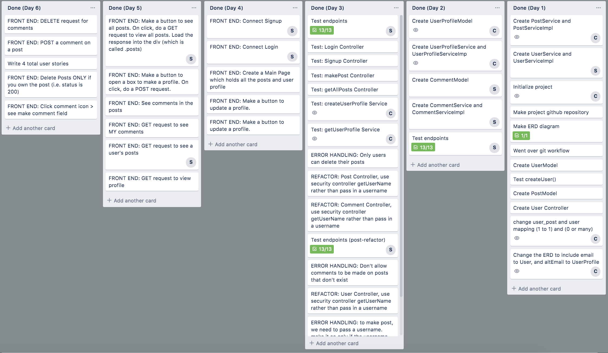
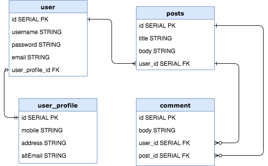

# Tea Room 
(aka AMEXProjecTwo)

# Team Members
Christine Le (<a href="https://github.com/le-christine">@le-christine</a>) 
Samantha Richards (<a href="https://github.com/srichards567">@srichards567</a>)

# Technologies Used
- PostgreSQL
- Springboot
- Java
- HTML/CSS/JavaScript

# General Approach
We started by designing an ERD diagram (see below). We used this model to implement the database. We started with the Models because we knew what we wanted each table to hold. User and UserProfile were first to be implemented because these tables were related one-to-one. When we made the Post model we added Security Implementation to ensure only authenticated users (with a token) could have access to the posts endpoints. We tracked our progress with Trello and marked completions daily to ensure we were on track. We frequently tested the endpoints with Postman, and with every data table modification we went into Postgres to see those reflected changes. Finally, we connected to this API from our website, Tea Room. Users are able to sign up and log in, write posts, and comments. They can also delete their own posts and comments.  

# Unsolved Problems and Major Hurdles
Some of our major hurdles were: 
- Setting up authorization so that only the user who created a post can delete it. 
- Receiving data that requires authorization through fetch requests. 
- Changing how user info displays in Postman. 

Our unsolved problems were: 
- Updating a user profile without rewriting previous data. 
 
# Planning
 
Six models are persisted to a PostgreSQL database. 
The `user` model has the fields: id, username, password, email, and user_profile_id. 
The `user_profile` model has the fields: id, mobile, address, and altEmail.  
The `user` maps `user_profile` one-to-one and vice versa because each user has only one user profile. 
The `post` model has the fields id, title, user_id and body. This model maps to `user` many-to-one on user.user_profile_id = post.user_id because many posts can belong to one user. 
The `comment` model has the fields id, body, post_id, and user_id. This model maps `user` many-to-one because many comments can have one user. `User` maps `comment` one-to-one because only one user belongs to a comment. `Comment` maps `post` many-to-one because one post can have many comments.  

We used Trello to break down the project and set tasks for ourselves on a daily basis. 
Link to Trello Board: https://trello.com/b/AlYHVCIu/project-2

# User Stories
1. As Paul, I want to make an account on Tea Room so I can be a member of the online community. 
2. As a psych major, I want to read users' opinions on the latest topics so I can get inspiration for my research.
3. As Sally, I want to create a comment in response to a post so I can get clarification on what the author meant.
4. As a job seeker I want to delete a post so that my potential employer does not see my NSFW posts.

