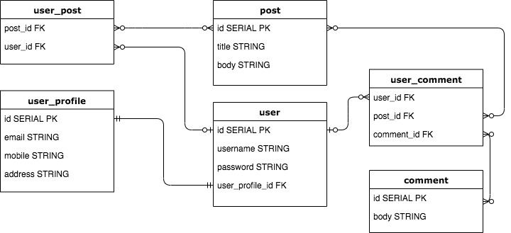

# AMEXProjectTwo

# Team Members
Christine Le(<a href="https://github.com/le-christine">@le-christine</a>) 
Samantha Richards(<a href="https://github.com/srichards567">@srichards567</a>)

# Technologies Used
- PostgreSQL
- Springboot
- Java
- HTML/CSS/JavaScript

# General Approach

# Unsolved Problems

# Planning
 
Six models are persisted to a PostgreSQL database. 
The `user` model has the fields: id, username, password, email, and user_profile_id. 
The `user_profile` model has the fields: id, mobile, address, and altEmail.  
The `user` maps `user_profile` one-to-one and vice versa because each user has only one user profile. 
The `posts` model has the fields id, title, and body.  
The model `user_post` joins user.id and posts.id and holds information about each post's creator. The `user_post` maps to `user` on a zero-or-one relationship because it will contain only one user's user_id whereas `user` maps to `user_post` on a zero-to-many relationship because a user may have zero or more than one post.  
The `comments` model has the fields id, body. 
There are two join models, `user_post` and `user_comment`. 

# Installation Instructions

# User Stories
